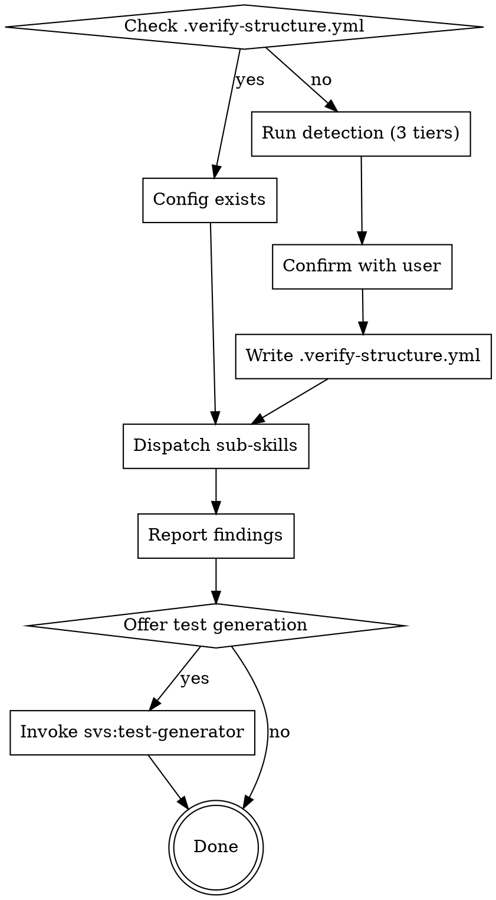

# Verify Structure

Entry point for the full structural verification workflow. Auto-detects language and framework, confirms architecture intent, dispatches sub-skills, reports findings, and generates CI-enforcing test files.

## Full Workflow



## Detection — 3 Tiers

**Tier 1 — Language & build (parse manifest content, not just existence):**
- `pyproject.toml` / `setup.py` → Python
- `package.json` → Node.js
- `pom.xml` / `build.gradle` → Java or Kotlin
- `go.mod` → Go
- `Cargo.toml` → Rust
- `*.csproj` / `*.sln` → C#

**Tier 2 — Framework (parse `dependencies` section of manifest):**
- `package.json dependencies["react"]` → React frontend
- `package.json dependencies["@nestjs/core"]` → NestJS
- `pom.xml spring-boot-starter-web` → Spring MVC
- `pyproject.toml dependencies["django"]` → Django
- `pyproject.toml dependencies["fastapi"]` → FastAPI

**Tier 3 — Architecture intent (hypothesis only, must confirm):**
- Presence of `domain/`, `infrastructure/`, `application/` dirs → propose Clean/Layered Architecture
- Presence of `controllers/`, `models/`, `views/` → propose MVC
- No clear signal → ask: "Please describe your intended layer structure"

**Never infer architecture from folder names without confirmation.** Folders can lie — the tool exists to catch that.

## Dispatch Table

| Condition | Sub-skills invoked |
|---|---|
| Always | `svs:metrics` |
| OOP language | `svs:solid` |
| `.verify-structure.yml` present | `svs:architecture` |
| Web framework detected | `svs:api-design` |

**REQUIRED SUB-SKILL:** Use `svs:metrics`, `svs:solid`, `svs:architecture`, `svs:api-design` as appropriate.

## Report Format

```
── Structural Issues Found ───────────────────────────────
[error]   src/domain/user.py:3
          ARCH.LAYER_BOUNDARY — domain imports infrastructure.db
          Fix: Define UserRepository interface in domain; inject via constructor

[error]   src/domain/user.py:3
          SOLID.DIP — domain directly instantiates infrastructure class
          Fix: Same as above

[warning] src/application/user_service.py:4
          METRICS.COMPLEXITY — process() complexity=11 (threshold: 10)
          Fix: Extract nested conditions into guard clauses

[warning] src/api/users.py
          ARCH.FAT_CONTROLLER — 9 route handlers (threshold: 7)
          Fix: Split into UserReadRouter and UserWriteRouter
──────────────────────────────────────────────────────────
2 errors, 2 warnings

Generate architecture tests to enforce these rules in CI? [Y/n]
```

## `.verify-structure.yml` Format

Write this file on first run after user confirmation:

```yaml
language: python              # detected language
framework: fastapi            # detected framework (or "none")
architecture:
  type: layered               # layered | clean | hexagonal | mvc | none
  layers:
    - name: domain
      source_paths: [src/domain]
      allowed_imports: []
    - name: application
      source_paths: [src/application]
      allowed_imports: [domain]
    - name: infrastructure
      source_paths: [src/infrastructure]
      allowed_imports: [domain, application]
    - name: presentation
      source_paths: [src/api]
      allowed_imports: [application]
```

## Re-run Behavior

If `.verify-structure.yml` exists: skip detection entirely, print "Config found: `<path>`. Running analysis..." and proceed to dispatch.

## Error Cases

- **No recognizable manifest:** "Cannot determine language. Please run from the project root or specify language manually."
- **Conflicting signals:** "I see both `pom.xml` (Java) and `package.json` (Node.js). Is this a monorepo? Which should I analyze?"
- **No architecture signals:** "I cannot infer your layer structure. Please describe your intended layers or point me to architecture documentation."
